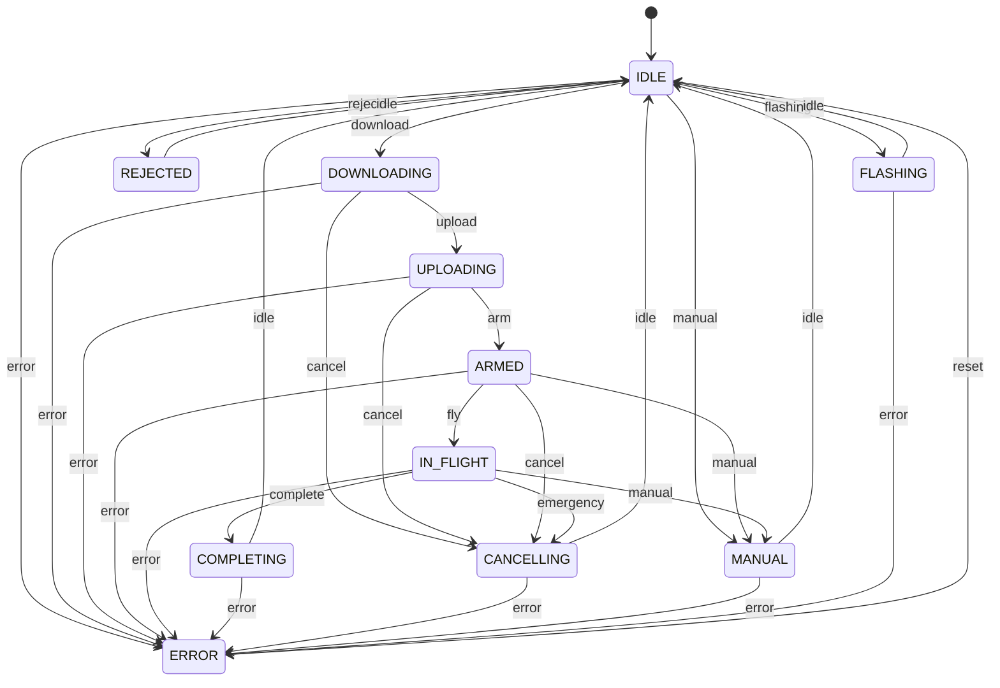

# State Machine

The [`OnboardAgent`](components.md#onboard-agent) uses a state machine to manage the lifecycle of drone operations, from mission planning to execution and emergency handling.

## State Machine Diagram

## State Descriptions

| State | Description |
| :--- | :--- |
| **IDLE** | The default state where the agent is waiting for a new job or command. |
| **DOWNLOADING** | The agent is fetching the mission bundle (waypoints, metadata) from S3. |
| **UPLOADING** | Post-download phase where local resources are being prepared or validated before flight. |
| **ARMED** | The drone's flight controller is armed and ready for takeoff. |
| **IN_FLIGHT** | The drone is actively executing the mission (i.e., performing a survey). |
| **COMPLETING** | Finalizing the mission, ensuring telemetry is synced and the job is marked as successful. |
| **ERROR** | A critical fault occurred. The agent requires a `reset` event to return to `IDLE`. |
| **CANCELLING** | Triggered by an operator `cancel` or an `emergency` during flight. Handles safe termination. |
| **REJECTED** | The mission was rejected due to validation failure or safety constraints. |
| **MANUAL** | The operator has taken manual control (via gamepad, or onscreen joystick), overriding autonomous flight. |
| **FLASHING** | The agent is updating the flight controller (PX4) firmware. |

## Event Triggers

- **download:** Initiated when an AWS IoT Job is received.
- **upload:** Transition after mission bundle verification.
- **arm/fly:** Steps to transition from preparation to active autonomous mission.
- **manual:** Overrides autonomous states to allow direct pilot control via [`FleetCoreDesktop`](./components.md#fleetcore-desktop).
- **emergency/cancel:** Safely aborts the current operation and transitions to `CANCELLING`.
- **error:** Can occur in almost any state, pushing the agent into the `ERROR` recovery state.
- **reset:** Clears the error state and returns the agent to `IDLE`.
